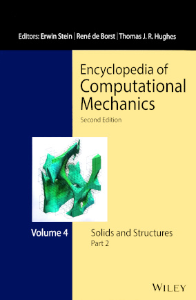

# Science

Nutils has been used in scientific publications since its earliest releases,
such as [this 2015 analysis of a trabecular bone
fragment](http://dx.doi.org/10.1016/j.cma.2014.07.009) by Verhoosel et al,
combining several of Nutils' strengths including the Finite Cell Method,
hierarchical refinement, and isogeometric analysis. One of its images was later
selected to feature as cover art for the [Encyclopedia of Computational
Mechanics](https://www.wiley.com/en-us/Encyclopedia+of+Computational+Mechanics%2C+6+Volume+Set%2C+2nd+Edition-p-9781119003793).

Nutils has since been used in a wide range of applications, pushing the
boundaries of computational techniques, studying physical phenomena, and
testing new models. The [publication overview](science-publications.md) lists
an up to date selection of Nutils powered research. If you are using Nutils in
your own research, please consider [citing Nutils](publications-citing.md) in
your publications.
