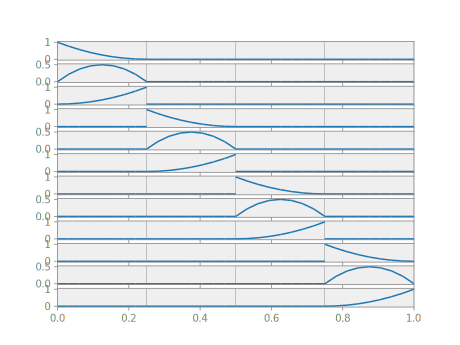

# Bases

In Nutils, a *basis* is a vector-valued function object that evaluates, in any
given point $ξ$ on the topology, to the full array of basis function
values $φ_0(ξ), φ_1(ξ), \dots, φ_{n-1}(ξ)$. It must be pointed out that
Nutils will in practice operate only on the basis functions that are locally
non-zero, a key optimization in Finite Element computations. But as a concept,
it helps to think of a basis as evaluating always to the full array.

Several `nutils.topology.Topology` objects support creating bases via the
`Topology.basis()` method. A `nutils.topology.StructuredTopology`, as generated
by `nutils.mesh.rectilinear`, can create a spline basis with arbitrary degree
and arbitrary continuity. The following generates a degree one spline basis on
our previously created unit line topology `topo`:

```python
basis = topo.basis('spline', degree=1)
```

The five basis functions are

```python
plot_line(basis)
```


We will use this basis throughout the following sections.

Change the `degree` argument to `2` for a quadratic spline basis:

```python
plot_line(topo.basis('spline', degree=2))
```


By default the continuity of the spline functions at element edges is the
degree minus one.  To change this, pass the desired continuity via keyword
argument `continuity`.  For example, a quadratic spline basis with $C^0$
continuity is generated with

```python
plot_line(topo.basis('spline', degree=2, continuity=0))
```


$C^0$ continuous spline bases can also be generated by the `'std'` basis:

```python
plot_line(topo.basis('std', degree=2))
```


The `'std'` basis is supported by topologies with square and/or triangular
elements without hanging nodes.

Discontinuous basis functions are generated using the `'discont'` type, e.g.

```python
plot_line(topo.basis('discont', degree=2))
```

