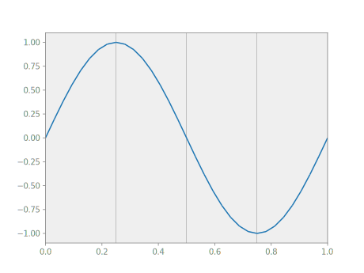

# Functions

A *function* in Nutils is a mapping from a topology onto an n-dimensional
array, and comes in the form of a functions: `nutils.function.Array` object. It
is not to be confused with Python's own function objects, which operate on the
space of general Python objects. Two examples of Nutils functions have already
made the scene: the geometry `geom`, as returned by `nutils.mesh.rectilinear`,
and the bases generated by `Topology.basis()`. Though seemingly different,
these two constructs are members of the same class and in fact fully
interoperable.

The `nutils.function.Array` functions behave very much like `numpy.ndarray`
objects: the functions have a `nutils.function.Array.shape`,
`nutils.function.Array.ndim` and a `nutils.function.Array.dtype`:

```python
geom.shape
# (1,)
basis.shape
# (5,)
geom.ndim
# 1
geom.dtype
# <class 'float'>
```

The functions support numpy-style indexing.  For example, to get the first
element of the geometry `geom` you can write `geom[0]` and to select the first
two basis functions you can write

```python
myplot(topo, geom, basis[:2])
```


The usual unary and binary operators are available:

```python
myplot(topo, geom, geom[0]*(1-geom[0])/2)
```


Several trigonometric functions are defined in the `nutils.function` module.
An example with a sine function:

```python
myplot(topo, geom, numpy.sin(2*geom[0]*numpy.pi))
```


The dot product is available via the '@' operator. To contract the basis with an
arbitrary coefficient vector:

```python
myplot(topo, geom, basis @ [1,2,0,5,4])
```


Recalling the definition of the [discrete
solution](tutorial-theory.md#discrete-solution), the above is precisely the way
to evaluate the resulting function. What remains now is to establish the
coefficients for which this function solves the Laplace problem.

## Arguments

A discrete model is often written in terms of (vectors of) unknowns. In Nutils,
unknowns are represented by functions of type `nutils.function.Argument`, which
have a known shape but undefined contents. Every argument has a name to
identify it, which cannot be reused for different arguments in the same
expression.

The [discrete solution](tutorial-theory.md#discrete-solution) can now be
written as an inner product with a basis, with the vector of unknowns
$\hat{u}_n$ represented by the argument `'u'`:
```python
from nutils.function import Argument
u = basis @ Argument('u', basis.shape)
```

Since it is slightly tedious to create an argument that has a matching shape to
an existing basis, the function module provides a convenience function that
does the work for you.
```python
from nutils.function import field
u = field('u', basis)
```

Moreover, as it is rarely necessary to manipulate a basis directly, the
topology object adds a layer of convenience that creates the basis, contracts
it with an argument, and returns only the result. This is the form that we will
most often encounter:
```python
u = topo.field('u', btype='spline', degree=1)
```

If a function depends on one or more arguments, then their values must be
specified at evaluation time. However we cannot demonstrate that yet for the
discrete solution defined here as it still requires a specification of the
relevant topological points. This will be the subject of
[integrals](tutorial-integrals.md).

What we can do is take derivatives with respect to arguments. The derivative
appends the argument shape to that of the original function. Here we take the
derivative of u, the function, with respect to 'u', the argument, to
effectively extract the basis:
```python
basis = u.derivative('u')
```
