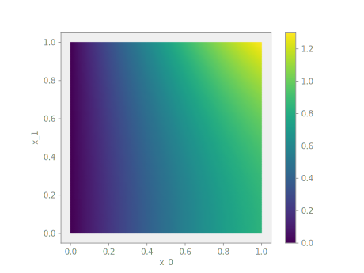

# 2D Laplace Problem

All of the above was written for a one-dimensional example.  We now extend the
Laplace problem to two dimensions and highlight the changes to the
corresponding Nutils implementation.  Let $Ω$ be a unit square with
boundary $Γ$, on which the following boundary conditions apply:

$$ \begin{cases}
u = 0 & Γ_\text{left} \\
\frac{∂u}{∂x_i} n_i = 0 & Γ_\text{bottom} \\
\frac{∂u}{∂x_i} n_i = \cos(1) \cosh(x_1) & Γ_\text{right} \\
u = \cosh(1) \sin(x_0) & Γ_\text{top}
\end{cases} $$

The 2D homogeneous Laplace solution is the field $u$ for which $R(v,
u) = 0$ for all v, where

$$ R(v, u) := \int_Ω \frac{∂v}{∂x_i} \frac{∂u}{∂x_i} \ dV - \int_{Γ_\text{right}} v \cos(1) \cosh(x_1) \ dS. $$

Adopting a Finite Element basis $\{φ_n\}$ we obtain the discrete solution
$\hat{u}(x) = φ_n(x) \hat{u}_n$ and the system of equations $R(φ_n,
\hat{u}) = 0$.

Following the same steps as in the 1D case, a unit square mesh with 10x10
elements is formed using `nutils.mesh.rectilinear`:

```python
nelems = 10
topo, geom = rectilinear([
    numpy.linspace(0, 1, nelems+1), numpy.linspace(0, 1, nelems+1)])
```

Recall that `nutils.mesh.rectilinear` takes a list of element vertices per
dimension.  Alternatively you can create a unit square mesh using
`nutils.mesh.unitsquare`, specifying the number of elements per dimension and
the element type:

```python
topo, geom = unitsquare(nelems, 'square')
```

The above two statements generate exactly the same topology and geometry.  Try
replacing `'square'` with `'triangle'` or `'mixed'` to generate a unit square
mesh with triangular elements or a mixture of square and triangular elements,
respectively.

We start with a clean namespace, assign the geometry to `ns.x`, create a linear
basis and define the solution `ns.u` as the contraction of the basis with
argument `lhs`.

```python
ns = Namespace()
ns.x = geom
ns.define_for('x', gradient='∇', normal='n', jacobians=('dV', 'dS'))
ns.u = topo.field('u', btype='std', degree=1)
ns.v = topo.field('v', btype='std', degree=1)
```

Note that the above statements are identical to those of the one-dimensional
example.

The residual is implemented as

```python
res = topo.integral('∇_k(v) ∇_k(u) dV' @ ns, degree=2)
res -= topo.boundary['right'].integral('v cos(1) cosh(x_1) dS' @ ns, degree=2)
```

The Dirichlet boundary conditions are rewritten as a least squares problem and
solved for `u`, yielding the constraints vector `cons`:

```python
sqr = topo.boundary['left'].integral('u^2 dS' @ ns, degree=2)
sqr += topo.boundary['top'].integral('(u - cosh(1) sin(x_0))^2 dS' @ ns, degree=2)
cons = System(sqr, trial='u').solve_constraints(droptol=1e-15)
# optimize > solve > solving 21 dof system to machine precision using arnoldi solver
# optimize > solve > solver returned with residual 3e-17±2e-15
# optimize > constrained 21/121 dofs
# optimize > optimum value 4.32e-10±1e-9
```

To solve the problem `res=0` for `u` subject to `cons['u']` excluding
the `nan` values, we use the system's `solve` method:

```python
args = System(res, trial='u', test='v').solve(constrain=cons)
# solve > solving 100 dof system to machine precision using arnoldi solver
# solve > solver returned with residual 2e-15±2e-15
```

Finally, we plot the solution.  We create a `nutils.sample.Sample` object from
`topo` and evaluate the geometry and the solution:

```python
myplot(topo, ns.x, ns.u, args)
```


This two-dimensional example is also available as the script `examples/laplace.py`.
