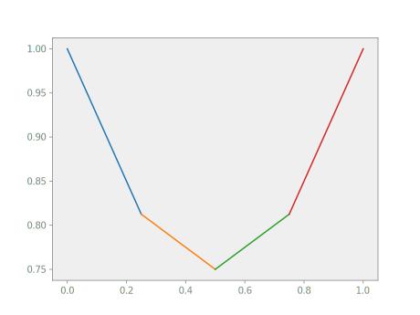

# Sampling

Having obtained the coefficient vector that solves the Laplace problem, we are
now interested in visualizing the function it represents. Nutils does not
provide its own post processing functionality, leaving that up to the
preference of the user. It does, however, facilitate it, by allowing
`nutils.function.Array` functions to be evaluated in samples. Bundling function
values and a notion of connectivity, these form a bridge between Nutils' world
of functions and the discrete realms of [matplotlib](https://matplotlib.org/),
VTK, etc.

The `Topology.sample(method, ...)` method generates a collection of points on
the `nutils.topology.Topology`, according to `method`. The `'bezier'` method
generates equidistant points per element, including the element vertices.  The
number of points per element per dimension is controlled by the second argument
of `Topology.sample()`.  An example:

```python
bezier = topo.sample('bezier', 2)
```

The resulting `nutils.sample.Sample` object can be used to evaluate
`nutils.function.Array` functions via the `Sample.eval(func)` method. To
evaluate the geometry `ns.x` write

```python
x = bezier.eval('x_0' @ ns)
x
# array([0.  , 0.25, 0.25, 0.5 , 0.5 , 0.75, 0.75, 1.  ])±1e-15
```

The first axis of the returned `numpy.ndarray` represents the collection of
points.  To reorder this into a sequence of lines in 1D, a triangulation in 2D
or in general a sequence of simplices, use the `Sample.tri` attribute:

```python
x[bezier.tri]
# array([[0.  , 0.25],
#        [0.25, 0.5 ],
#        [0.5 , 0.75],
#        [0.75, 1.  ]])±1e-15
```

Now, the first axis represents the simplices and the second axis the vertices
of the simplices.

If an `nutils.function.Array` function has arguments, those arguments must be
specified by keyword arguments to `Sample.eval()`. For example, to evaluate
`ns.u` with argument `lhs` replaced by solution vector `lhs`, obtained using
`nutils.solver.solve_linear` above, write

```python
u = bezier.eval('u' @ ns, arguments=args)
u
# array([0.  , 0.25, 0.25, 0.5 , 0.5 , 0.75, 0.75, 1.  ])±1e-15
```

We can now plot the sampled geometry `x` and solution `u` using `matplotlib`,
plotting each line in `Sample.tri` with a different color:

```python
pyplot.plot(x[bezier.tri.T], u[bezier.tri.T])
```


The `pyplot.plot()` function takes an array of x-values and and array of
y-values, both with the first axis representing vertices and the second
representing separate lines, hence the transpose of `bezier.tri`.

In our `myplot` utility function we call `nutils.export.triplot` to create a
single line plot out of the many segments, aided by its own `tri` argument for
element connectivity. It further generalizes to 2D (and 3D), as we will see in
the following section.
