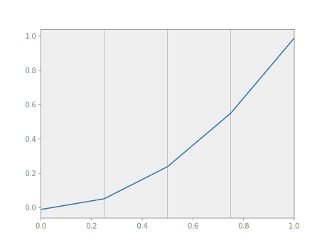

# Solvers

Using topologies, bases and integrals, we now have the tools in place to start
performing some actual functional-analytical operations. We start with what is
perhaps the simplest of its kind, the least squares projection, demonstrating
the different implementations now available to us and working our way up from
there.

Taking the function $x_0^2$ as an example, to project it onto the discrete
space means finding the discrete solution $\hat{u}$ such that, for all discrete
test functions $\hat{v}$:

$$ \int_Ω \hat v \hat u \ dV = \int_Ω \hat v x_0^2 \ dV $$

In terms of the discrete coefficients this becomes the linear system $A_{nm}
\hat{u}_m = f_n$. This is implemented as follows:

```python
ns.u = topo.field('u', btype='spline', degree=1)
ns.v = topo.field('v', btype='spline', degree=1)
A, f = function.eval([
    topo.integral('v u dV' @ ns, degree=2).derivative('v').derivative('u'),
    topo.integral('v x_0^2 dV' @ ns, degree=2).derivative('v')])
u = numpy.linalg.solve(A, f)
# array([-0.01041667,  0.05208333,  0.23958333,  0.55208333,  0.98958333])
```


Alternatively, we can write this in the slightly more general form

$$ R := \int_Ω \hat v (\hat u - x_0^2) \ dV = 0. $$

```python
res = topo.integral('v (u - x_0^2) dV' @ ns, degree=2)
```

After taking the derivative with respect to the test function 'v', the
derivative to 'u' gives the above matrix $A$, whereas substitution of the zero
vector for 'u' yields `-f`. Nutils can compute those derivatives for you, using
the method `Array.derivative()` to compute the derivative with respect to an
`nutils.function.Argument`, returning a new `nutils.function.Array`.

```python
A, f = function.eval([
    res.derivative('v').derivative('u'),
    -res.derivative('v')], arguments={'u': numpy.zeros(5)})
u = numpy.linalg.solve(A, f)
# array([-0.01041667,  0.05208333,  0.23958333,  0.55208333,  0.98958333])
```

The above three lines are so common that they are combined in the `solve`
method of `nutils.solver.System`:

```python
args = solver.System(res, trial='u', test='v').solve()
# {'u': array([-0.01041667,  0.05208333,  0.23958333,  0.55208333,  0.98958333])}
```

We can take this formulation one step further.  Minimizing

$$ S := \int_Ω (\hat u - x_0)^2 \ dV $$

for $\hat{u}$ is equivalent to the above two variants, as the derivative of $S$
to $\hat{u}$ equals $2 R$.

```python
sqr = topo.integral('(u - x_0)^2 dV' @ ns, degree=2)
solver.System([sqr.derivative('u')], trial='u').solve()
# {'u': array([-0.01041667,  0.05208333,  0.23958333,  0.55208333,  0.98958333])}
```
Since `sqr.derivative('u')` is vector valued, `solve` understands that its
assignment is to make the entire vector zero, and no test function needs to be
specified. However, we can go one step shorter by providing `sqr` as is, in
which case `solve` interprets the absence of the test argument as being equal
to the trial. The result is the same as before, with the added benefit of
informing System that the linear system it is solving is symmetric.

```python
solver.System(sqr, trial='u').solve()
# {'u': array([-0.01041667,  0.05208333,  0.23958333,  0.55208333,  0.98958333])}
```

The System object also supports solving a partial optimization problem via its
`solve_constraints` method, so called because this is typically used for
Dirichlet constraints. This method returns an array with `nan` ('not a number')
for every entry for which the optimization problem is invariant, or to be
precise, where the variation is below the mandatory `droptol` argument.

## Putting it together

We are now in a position to consider again the Laplace problem stated above.
The Dirichlet boundary condition at $Γ_\text{left}$ minimizes the following
functional:

```python
sqr = topo.boundary['left'].integral('(u - 1)^2 dS' @ ns, degree=2)
```

We use the `solve_constraints` method to solve this least squares problem for
the single degree of freedom involved, leaving the others at not a number to
signify that the are yet to be defined:

```python
cons = solver.System(sqr, trial='u').solve_constraints(droptol=1e-15)
# {'u': array([ 1., nan, nan, nan, nan])}
```

The [residual](tutorial-theory.md#weak-form) is implemented as

```python
res = topo.integral('(∇_k(v) ∇_k(u) + 2 v) dV' @ ns, degree=2)
res -= topo.boundary['right'].integral('v dS' @ ns, degree=2)
```

We can use the system's `solver` method to solve this problem, with the
constraints passed in via the `constrain` keyword argument:

```python
args = solver.System(res, trial='u', test='v').solve(constrain=cons)
# {'u': array([1.    , 0.8125, 0.75  , 0.8125, 1.    ])}
```

Note, finally, that the `solve` method actually does not require the problem to
be linear in 'u' at all; if it is not then it will automatically switch to
Newton iterations unless otherwise specified.
