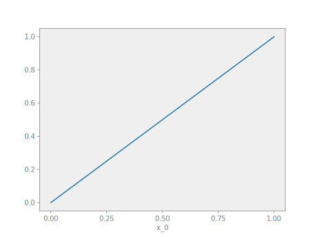

# Tutorial

In this tutorial we will explore Nutils' main building blocks by solving a
simple 1D Laplace problem. The tutorial assumes knowledge of the
[Python](https://www.python.org/) programming language, as well as familiarity
with the third party modules [Numpy](https://numpy.org/) and
[Matplotlib](https://matplotlib.org/). It also assumes knowledge of advanced
calculus, weak formulations, and the Finite Element Method, and makes heavy use
of [Einstein notation](https://en.wikipedia.org/wiki/Einstein_notation).

## Whetting your Appetite

The computation that we will work towards amounts to about 20 lines of Nutils
code, including visualization. The entire script is presented below, in
copy-pasteable form suitable for interactive exploration using for example
ipython. In the sections that follow we will go over these lines ones by one
and explain the relevant concepts involved.

```python
from nutils.mesh import rectilinear, unitsquare
from nutils.expression_v2 import Namespace
from nutils.solver import System
from nutils.export import triplot
from matplotlib import pyplot
import numpy

topo, geom = rectilinear([numpy.linspace(0, 1, 5)])

ns = Namespace()
ns.x = geom
ns.define_for('x', gradient='∇', normal='n', jacobians=('dV', 'dS'))
ns.u = topo.field('u', btype='spline', degree=2)
ns.v = topo.field('v', btype='spline', degree=2)

sqr = topo.boundary['left'].integral('(u - 1)^2 dS' @ ns, degree=2)
cons = System(sqr, trial='u').solve_constraints(droptol=1e-15)
# optimize > constrained 1/5 dofs
# optimize > optimum value 0.00e+00

res = topo.integral('(∇_k(v) ∇_k(u) + 2 v) dV' @ ns, degree=2)
res -= topo.boundary['right'].integral('v dS' @ ns, degree=2)
args = System(res, trial='u', test='v').solve(constrain=cons)
# solve > solving 4 dof system to machine precision using arnoldi solver
# solve > solver returned with residual 9e-16±1e-15

def myplot(topo, geom, func, args={}):
    bezier = topo.sample('bezier', 9)
    x, f = bezier.eval([geom, func if func.ndim else [func]], arguments=args)
    fig, axs = pyplot.subplots(nrows=f.shape[1], sharex=True, squeeze=False)
    for (ax,), f in zip(axs, f.T):
        triplot(ax, x, f, tri=bezier.tri, hull=bezier.hull)

myplot(topo, ns.x, ns.u, args)
```


You are encouraged to execute this code at least once before reading on, as the
code snippets that follow may assume certain products to be present in the
namespace. In particular the `plot_line` function is used heavily in the
ensuing sections.
